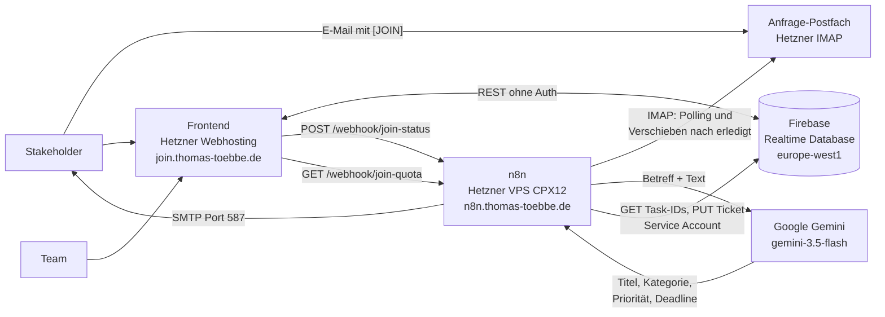
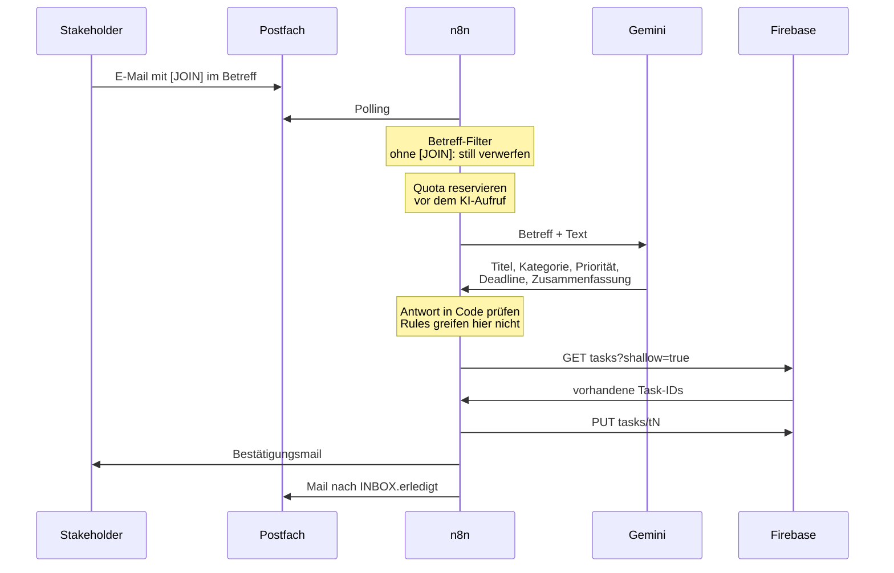

# Join — Issue Collector

Kanban-Board mit KI-gestütztem Issue Collector. Stakeholder reichen Feature
Requests per E-Mail ein; ein n8n-Workflow analysiert die Mail, bestimmt
Kategorie, Titel, Priorität und Deadline und legt daraus automatisch ein Ticket
in der Triage-Spalte des Boards an.

Live: **https://join.thomas-toebbe.de**

Aufbauend auf [024_Join](https://github.com/ttoebbe/024_Join).

**In drei Sätzen:** Eine Mail mit `[JOIN]` im Betreff geht an die
Anfrageadresse **issues [at] thomas-toebbe.de**. Kurz darauf steht daraus ein
fertiges Ticket in der Spalte **Triage** des Boards. Wird es dort in eine
andere Spalte gezogen, bekommt der Ersteller automatisch eine Mail über den
neuen Stand.

---

## Wie die Demo funktioniert

1. Landing Page öffnen und „Create request" wählen
2. E-Mail an **issues [at] thomas-toebbe.de** schicken — der Betreff **muss** mit
   `[JOIN]` beginnen, Groß- und Kleinschreibung ist egal
3. Der n8n-Workflow verarbeitet die Mail und legt das Ticket in **Triage** an
4. Der Absender bekommt eine Bestätigungsmail und wird als externer Ersteller
   am Ticket geführt
5. Wird das Ticket auf dem Board in eine andere Spalte gezogen, geht eine
   Benachrichtigung an den Ersteller

Eine brauchbare Anfrage schreibt sich wie eine kurze Mail an einen Kollegen:

```
An:      issues [at] thomas-toebbe.de
Betreff: [JOIN] Board lädt zu langsam

Das Board braucht auf dem Handy mehrere Sekunden, bis die Karten da sind.
Das ist dringend, wir zeigen es am 30.09.2026 dem Kunden.
```

Aus Betreff und Fließtext bestimmt die KI Titel, Kategorie (`Technical Task`
oder `User Story`), Priorität (`urgent`, `medium`, `low`) und — falls im Text
eine Deadline steht — das Fälligkeitsdatum. Ein Datum wird nie erfunden. Im
Beschreibungstext des Tickets steht der Hinweis, dass es KI-generiert wurde.

Was sonst noch passieren kann:

| Fall | Was der Absender bekommt |
|---|---|
| Betreff **ohne** `[JOIN]` | nichts. Die Mail wird kommentarlos verworfen, damit Spam keine Antwort und kein Kontingent bekommt. |
| Tageslimit erreicht | eine Mail mit dem Hinweis auf das Limit und dem Zeitpunkt, an dem es zurückgesetzt wird. Kein Ticket. |
| Mail nicht verwertbar | eine Mail mit dem Hinweis, dass das Team sie erhalten hat und sich meldet. |

Pro Tag werden maximal **10** Anfragen verarbeitet, davon höchstens **3** je
Absender. Der aktuelle Stand wird auf der Landing Page angezeigt. Das Limit ist
ein Kostenschutz für die KI-API und wird täglich um Mitternacht UTC
zurückgesetzt.

---

## Architektur

Drei Systeme, die nichts voneinander wissen müssen: das Frontend liegt als
statische Dateien auf dem Webhosting, n8n läuft in Docker auf einem VPS, und
die Datenbank ist eine gehostete Firebase Realtime Database.



Was das Bild nicht zeigt: n8n bekommt für Join **keinen eigenen Server**,
sondern teilt sich die bestehende Instanz auf dem Code-a-Cuisine-VPS mit den
dortigen Workflows — deshalb hat Join eine eigene Zählerdatei und eigene
Webhook-Pfade, damit sich die beiden Projekte nicht in die Quere kommen.

Die beiden Pfeile zur Datenbank sind **nicht gleichwertig**: n8n schreibt über
einen Service Account, das Frontend spricht die REST-API dagegen ganz ohne
Authentifizierung an — Join hat kein Firebase Auth, sondern prüft den Login
selbst gegen den `users`-Knoten. Das ist ein bewusster Demo-Kompromiss, kein
gelöstes Sicherheitsproblem; was daraus für die Datenbank-Regeln folgt, steht
in [`docs/n8n-setup.md`](docs/n8n-setup.md), Abschnitt 4.

Der einzige Weg, auf dem Kosten entstehen, führt über den Gemini-Aufruf. Er ist
deshalb hinter das Tageslimit von 10 Anfragen gehängt — der Zähler ist kein
Komfortfeature, sondern der Kostendeckel.

### Von der Mail zum Ticket

Die Reihenfolge im Issue Collector ist kein Zufall — sie ist der Kostenschutz:



Der Quota-Slot wird **vor** dem Aufruf des Modells reserviert, nicht nach einem
erfolgreichen Ticket. Ein Fehlschlag der KI kostet damit ebenfalls einen Slot —
genau das macht den Zähler zum Kostendeckel und nicht zur Erfolgsstatistik.
Umgekehrt läuft der Betreff-Filter **vor** dem Zähler, damit eine Spam-Mail
weder ein Kontingent verbraucht noch eine Antwort bekommt.

„Rules greifen hier nicht" ist der wichtigste Hinweis im Bild: n8n schreibt mit
einem Service-Account-Token, und das gilt in der Realtime Database als
Admin-Zugriff — die `.validate`-Regeln aus `database.rules.json` werden dabei
übergangen. Die Prüfung im Code-Node `Map AI answer` ist deshalb die einzige,
die es für diesen Weg gibt.

---

## Features

- **Landing Page** — Weiche zwischen Stakeholder und Teammitglied, Prozess­erklärung, Tageslimit transparent
- **Issue Collector** — E-Mail-Empfang, KI-Analyse, automatische Ticket-Anlage
- **Triage-Spalte** — Standard-Backlog für alle neuen Tickets, manuell wie automatisch
- **Ersteller-Anzeige** — sichtbar im Task-Detail, unterscheidet intern (`Member`) und extern (`Extern`)
- **KI-Kennzeichnung** — Badge und Hinweis im Beschreibungstext
- **Statusbenachrichtigung** — Mail an den Ersteller bei Spaltenwechsel
- **Kanban-Board** — Drag & Drop, Suche, Subtasks, Prioritäten, Kontakte, Summary-Dashboard

---

## Tech-Stack

| Ebene | Technologie |
|---|---|
| Frontend | HTML5, CSS3, Vanilla JavaScript (ES6+) |
| Datenbank | Firebase Realtime Database (REST API) |
| Automatisierung | n8n (Docker, eigener VPS) |
| Build | keiner — statische Dateien |

---

## Lokal starten

Kein Build-Step nötig.

```bash
python -m http.server 8080
```

Dann `http://localhost:8080` öffnen.

Alternativ die VS-Code-Erweiterung *Live Server*: Rechtsklick auf `index.html`
→ *Open with Live Server*.

Die Seite muss über einen Server laufen, nicht per Doppelklick über `file://`.
Sign-up und Login hashen Passwörter mit `crypto.subtle`, und die Web Crypto API
gibt es nur im Secure Context — `http://localhost`, `http://127.0.0.1` und HTTPS
zählen dazu, `file://` nicht.

Zustände der Landing Page ohne laufendes n8n testen:

```
/html/pages/request.html            -> 0 of 10
/html/pages/request.html?used=4     -> 4 of 10
/html/pages/request.html?used=10    -> Limit erreicht
```

---

## Projektstruktur

```
├── index.html              # Landing Page (Stakeholder / Teammitglied)
├── assets/
│   ├── icons/              # aus Figma exportiert (neue Features)
│   ├── img/                # Bestand aus 024_Join (bestehende Screens)
│   ├── logos/, images/     # aus Figma
│   └── fonts/              # Inter + Open Sans als woff2
├── css/
│   ├── core/               # tokens.css (Design-Tokens), base.css
│   ├── landing/            # Landing-Strecke
│   ├── pages/              # App-Seiten
│   └── components/         # wiederverwendbare Komponenten
├── html/pages/             # App-Seiten inkl. login.html und request.html
├── js/
│   ├── core/               # Firebase-Service, Konstanten, Utilities
│   ├── features/           # auth, board, add-task, contacts, summary, landing
│   ├── components/         # Toast, Overlays
│   └── templates/          # Template-Renderer
├── n8n/                    # Workflows als JSON (laufen in der bestehenden Instanz)
├── docs/
│   ├── design/             # Design-Spec, Komponenten-Inventar, Referenzbilder
│   ├── n8n-setup.md        # Workflows einrichten und importieren
│   └── deployment.md       # Secrets und Ablauf des Deployments
└── tools/                  # Hilfsskripte (Demo-Kontakte seeden)
```

---

## Design

Das UI der neuen Funktionen stammt aus einer Figma-Datei, die vollständig
extrahiert und dokumentiert wurde:

- `docs/design/spec.md` — Foundations, Breakpoints, Frames, Komponenten
- `docs/design/components.md` — vollständiges Komponenten-Inventar
- `docs/design/reference/` — Referenz-Screenshots je Frame
- `docs/design/MANIFEST.md` — Herkunft jeder Asset-Datei mit Node-ID

Bestehende Screens aus 024_Join wurden bewusst nicht angeglichen.

---

## Deployment

Die Seite liegt auf **https://join.thomas-toebbe.de** und wird von Hand über
GitHub Actions ausgerollt: Reiter *Actions* → *Deploy frontend* →
*Run workflow*. Es gibt keinen Push-Trigger — ein Commit auf `main` verändert
die Live-Seite nicht.

Hochgeladen wird nur, was die Seite ausmacht: `index.html`, `html/`, `css/`,
`js/` und `assets/`. Welche Secrets der Workflow braucht, wo sie angelegt
werden und was nach einem Deploy zu prüfen ist, steht in
[`docs/deployment.md`](docs/deployment.md).

Die n8n-Seite — Workflows importieren, Credentials, Webhook-Pfade, CORS —
steht in [`docs/n8n-setup.md`](docs/n8n-setup.md).

`database.rules.json` wird von keinem Workflow mit ausgerollt. Wie die Regeln in
die Datenbank kommen, steht in
[`docs/deployment.md`](docs/deployment.md#7-datenbank-regeln-einspielen),
Abschnitt 7.

---

## Konfiguration

Die Firebase-URL steht in `js/core/constants.js`.
Zugangsdaten für n8n (Mailkonto, KI-API, Service Account) liegen ausschließlich
in der `.env` auf dem Server und sind über `.gitignore` ausgeschlossen.

---

## Lizenz

Privates, nicht kommerzielles Ausbildungsprojekt.
