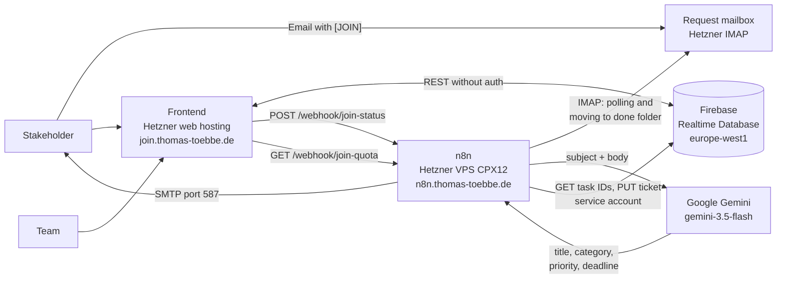
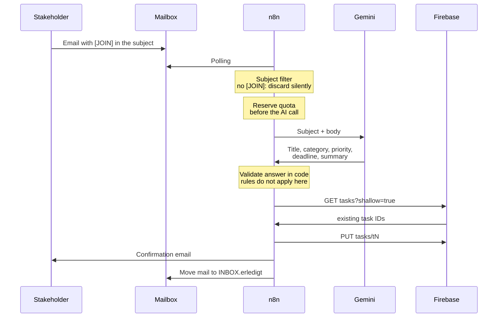

# Join — Issue Collector

Kanban board with an AI-powered issue collector. Stakeholders submit feature
requests by email; an n8n workflow analyzes the mail, determines category,
title, priority and deadline, and automatically creates a ticket in the
board's Triage column.

Live: **https://join.thomas-toebbe.de**

Built on top of [024_Join](https://github.com/ttoebbe/024_Join).

**In three sentences:** An email with `[JOIN]` in the subject goes to the
request address **issues [at] thomas-toebbe.de**. Shortly after, a finished
ticket appears in the **Triage** column of the board. When it is dragged to
another column, the creator automatically receives an email about the new
status.

---

## How the demo works

1. Open the landing page and choose "Create request"
2. Send an email to **issues [at] thomas-toebbe.de** — the subject **must**
   start with `[JOIN]`, case does not matter
3. The n8n workflow processes the mail and creates the ticket in **Triage**
4. The sender receives a confirmation email and is shown as the external
   creator on the ticket
5. When the ticket is dragged to another column on the board, a notification
   goes out to the creator

A useful request reads like a short email to a colleague:

```
To:      issues [at] thomas-toebbe.de
Subject: [JOIN] Board loads too slowly

The board takes several seconds on mobile until the cards show up.
This is urgent, we are presenting it to the customer on 2026-09-30.
```

From subject and body the AI determines title, category (`Technical Task`
or `User Story`), priority (`urgent`, `medium`, `low`) and — if the text
mentions a deadline — the due date. A date is never invented. The ticket's
description carries a note that it was AI-generated.

What else can happen:

| Case | What the sender receives |
|---|---|
| Subject **without** `[JOIN]` | nothing. The mail is silently discarded so spam gets neither a reply nor a quota slot. |
| Daily limit reached | an email pointing out the limit and the time it resets. No ticket. |
| Mail not usable | an email saying the team has received it and will follow up. |

At most **10** requests are processed per day, of which no more than **3**
per sender. The current count is shown on the landing page. The limit is a
cost guard for the AI API and resets daily at midnight UTC.

---

## Architecture

Three systems that do not need to know about each other: the frontend is
static files on web hosting, n8n runs in Docker on a VPS, and the database
is a hosted Firebase Realtime Database.



What the picture does not show: Join's workflows run in an existing n8n
instance that also serves another project — which is why Join has its own
counter file and its own webhook paths, so the two projects cannot get in
each other's way.

The two arrows to the database are **not** equivalent: n8n writes through a
service account, while the frontend talks to the REST API without any
authentication — Join has no Firebase Auth and checks the login itself
against the `users` node. This is a deliberate demo compromise, not a solved
security problem; what follows from it for the database rules is described
in [`docs/n8n-setup.md`](docs/n8n-setup.md), section 4.

The only path that costs money is the Gemini call. That is why it sits
behind the daily limit of 10 requests — the counter is not a convenience
feature but the cost cap.

### From mail to ticket

The order of steps in the issue collector is no accident — it is the cost
guard:



The quota slot is reserved **before** the model is called, not after a
successful ticket. A failed AI call therefore also costs a slot — exactly
this makes the counter a cost cap rather than a success statistic. The
subject filter, in turn, runs **before** the counter, so a spam mail neither
consumes quota nor gets a reply.

"Rules do not apply here" is the most important note in the picture: n8n
writes with a service account token, which the Realtime Database treats as
admin access — the `.validate` rules from `database.rules.json` are bypassed.
The check in the `Map AI answer` code node is therefore the only one that
exists on this path.

---

## Features

- **Landing page** — fork between stakeholder and team member, process explanation, transparent daily limit
- **Issue collector** — email intake, AI analysis, automatic ticket creation
- **Triage column** — default backlog for all new tickets, manual and automatic alike
- **Creator display** — visible in the task detail, distinguishes internal (`Member`) and external (`Extern`)
- **AI labeling** — badge plus a note in the description text
- **Status notification** — email to the creator on column change
- **Kanban board** — drag & drop, search, subtasks, priorities, contacts, summary dashboard

---

## Tech stack

| Layer | Technology |
|---|---|
| Frontend | HTML5, CSS3, vanilla JavaScript (ES6+) |
| Database | Firebase Realtime Database (REST API) |
| Automation | n8n (Docker, own VPS) |
| Build | none — static files |

---

## Running locally

No build step required.

```bash
python -m http.server 8080
```

Then open `http://localhost:8080`.

Alternatively use the VS Code extension *Live Server*: right-click
`index.html` → *Open with Live Server*.

The page must be served — a double-click via `file://` will not do. Sign-up
and login hash passwords with `crypto.subtle`, and the Web Crypto API only
exists in a secure context — `http://localhost`, `http://127.0.0.1` and
HTTPS qualify, `file://` does not.

Testing the landing page states without a running n8n:

```
/html/pages/request.html            -> 0 of 10
/html/pages/request.html?used=4     -> 4 of 10
/html/pages/request.html?used=10    -> limit reached
```

---

## Project structure

```
├── index.html              # Landing page (stakeholder / team member)
├── assets/
│   ├── icons/              # exported from Figma (new features)
│   ├── img/                # inherited from 024_Join (existing screens)
│   ├── logos/, images/     # from Figma
│   └── fonts/              # Inter + Open Sans as woff2
├── css/
│   ├── core/               # tokens.css (design tokens), base.css
│   ├── landing/            # landing pages
│   ├── pages/              # app pages
│   └── components/         # reusable components
├── html/pages/             # app pages incl. login.html and request.html
├── js/
│   ├── core/               # Firebase service, constants, utilities
│   ├── features/           # auth, board, add-task, contacts, summary, landing
│   ├── components/         # toast, overlays
│   └── templates/          # template renderers
├── n8n/                    # workflows as JSON (run in the existing instance)
└── docs/
    ├── design/             # design spec, component inventory, asset provenance
    ├── n8n-setup.md        # setting up and importing the workflows
    └── deployment.md       # secrets and the deployment procedure
```

---

## Design

The UI of the new features comes from a Figma file that was fully extracted
and documented:

- `docs/design/spec.md` — foundations, breakpoints, frames, components
- `docs/design/components.md` — complete component inventory
- `docs/design/reference/` — reference screenshots per frame, removed from
  the repo and reachable through the git history
- `docs/design/MANIFEST.md` — provenance of every asset file with its node ID

Existing screens from 024_Join were deliberately not restyled.

---

## Deployment

The site lives at **https://join.thomas-toebbe.de** and is rolled out
manually via GitHub Actions: *Actions* tab → *Deploy frontend* →
*Run workflow*. There is no push trigger — a commit on `main` does not
change the live site.

Only what makes up the site is uploaded: `index.html`, `html/`, `css/`,
`js/` and `assets/`. Which secrets the workflow needs, where they are
created and what to check after a deploy is described in
[`docs/deployment.md`](docs/deployment.md).

The n8n side — importing workflows, credentials, webhook paths, CORS — is
covered in [`docs/n8n-setup.md`](docs/n8n-setup.md).

`database.rules.json` is not rolled out by any workflow. How the rules get
into the database is described in [`docs/deployment.md`](docs/deployment.md),
section 7.

---

## Configuration

The Firebase URL is set in `js/core/constants.js`.
Credentials for n8n (mail account, AI API, service account) live exclusively
in the `.env` on the server and are excluded via `.gitignore`.

---

## License

Private, non-commercial training project.
